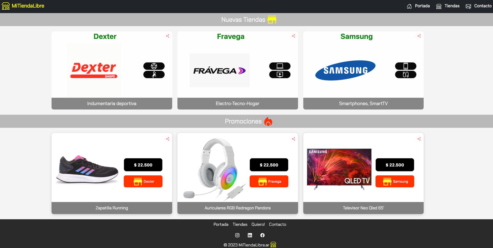

# Proyecto CoderHouse 
Proyecto Front de tienda online [MiTiendaLibre](https://luisbattle.github.io/mitiendalibre/) a modo unicamente práctico para el curso.



## Whimsical
`https://whimsical.com/tiendalibre-portada-THMA9C4DGQ4mrxGjZHZx6u`


# Pre-entregas
````
Jueves 27: Entrega
Sitio Web: 
- Crear 5 secciones HTML(linkeadas)
- Uso de Etiquetas semanticas
- Imagenes
- Css básico
- Wireframes(Mobile/desktop)
````

```
Martes 23-05
branch: feature/segunda-entrega

Mejoras/Features:
- Home renovado
    - Cards se ajustan a la pantalla con la utilización de flexbox
- Navbar
    - uso de Bootstrap
    - cambio de logo
    - menu responsive con navbar

- Footer renovado
- Media queries 
    - breakpoint mobile/tablet/desktop 
```
